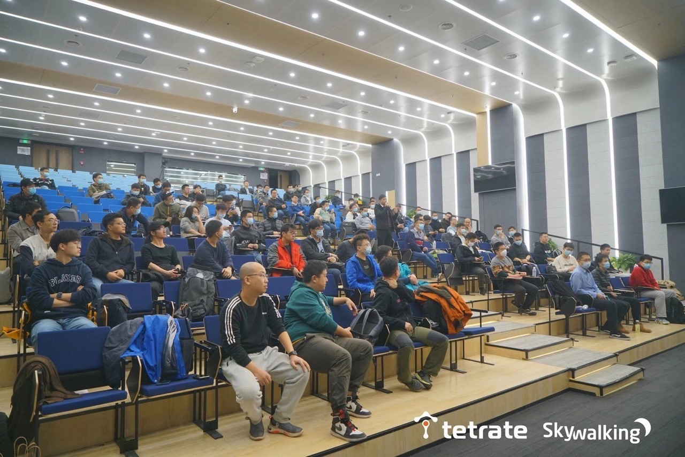
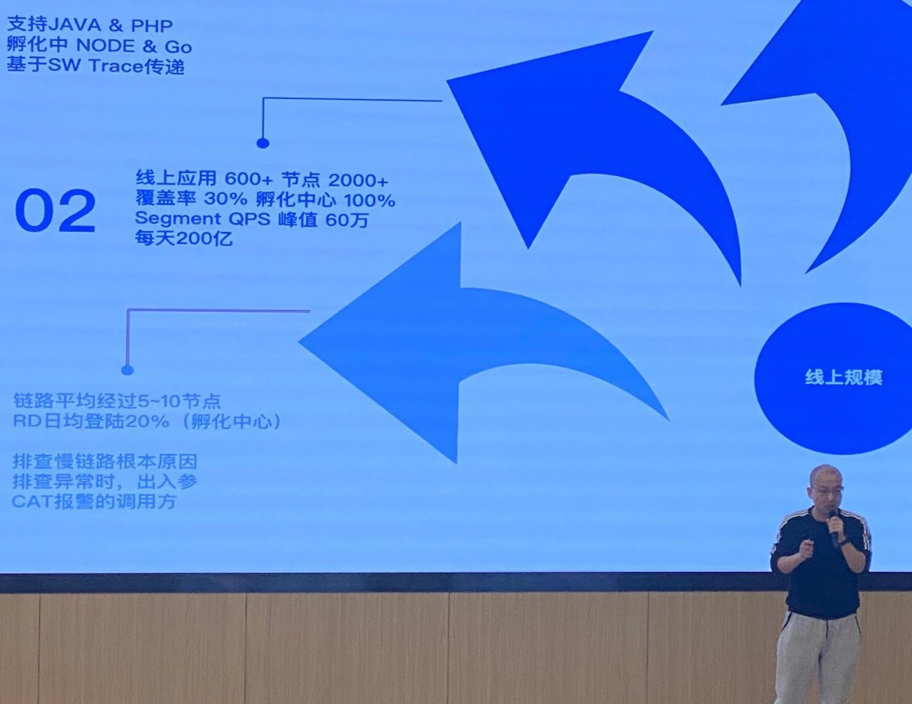
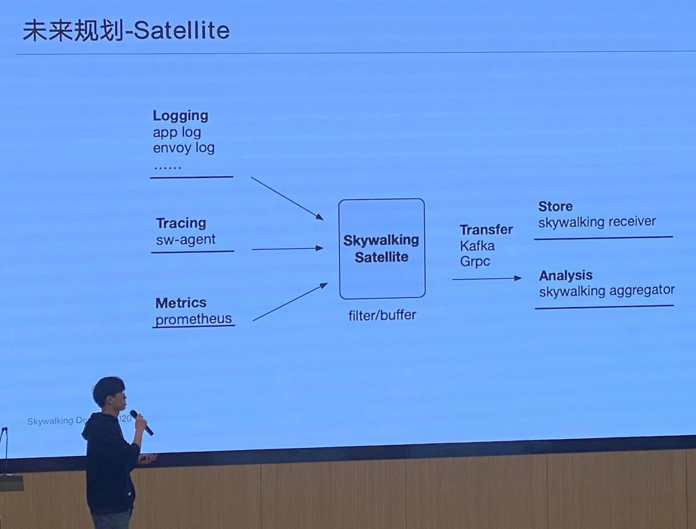
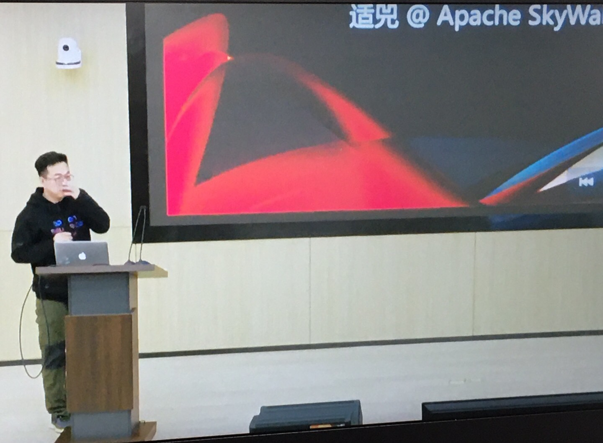
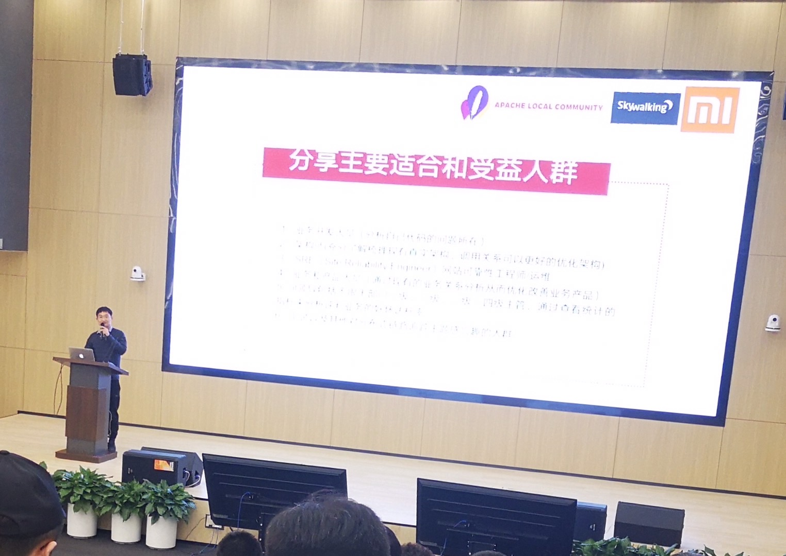
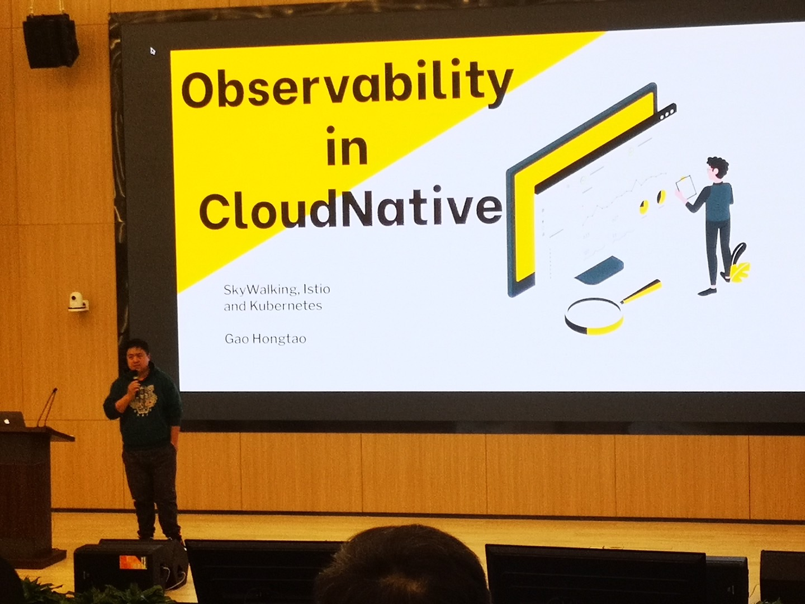
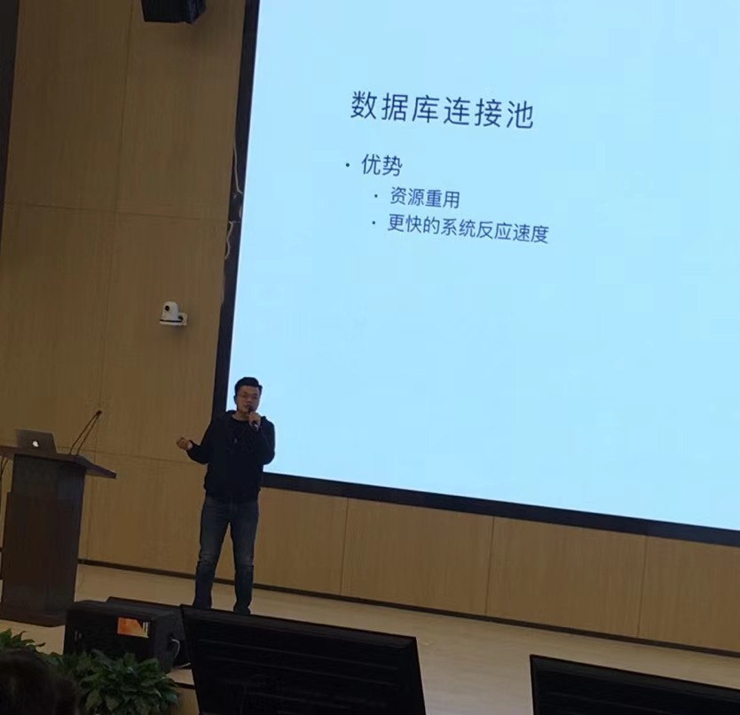
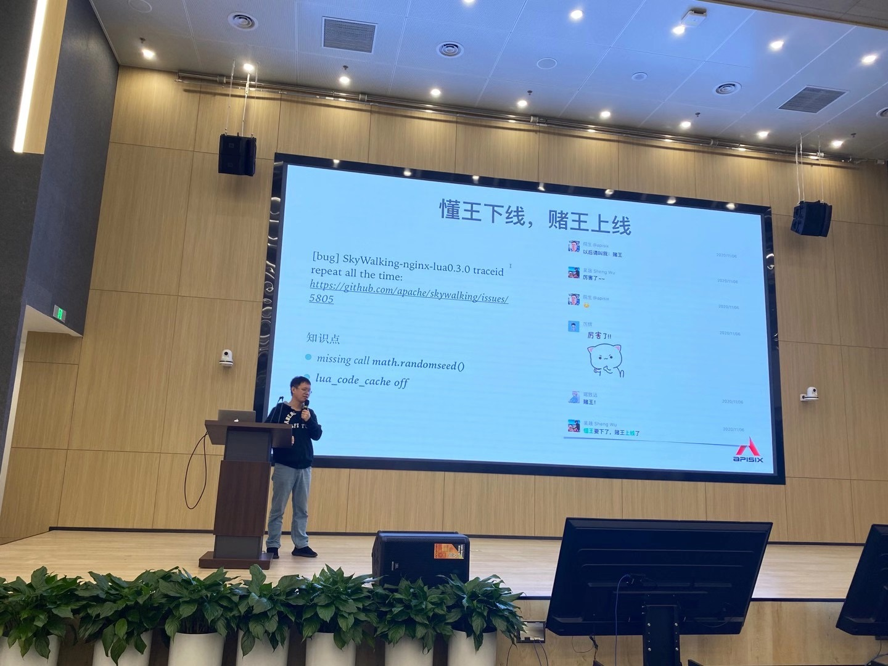

亲临百人盛况的Apache SkyWalking 2020 DevCon，看见了什么？

作者：赵禹光

###简介：

2020年11月14日Apache SkyWalking 2020 DevCon由贝壳找房和tetrate赞助，SkyWalking、云原生、APISIX、PULSAR和ALC Beijing五大社区合作，在贝壳找房一年级会议室盛大举行，本次活动主要面对Apache SkyWalking的使用者、开发者和潜在用户。线上线下共有230多人报名。经统计，实际参加活动人数超过130人，近60%的人愿意抽出自己的休息时间，来交流学习Apache SkyWalking和开源文化，不难看见，在可预见的未来，中国的开源很快将进入下一个维度，那必定是更广的社区人员参与，更高技术知识体现，更强的线上稳定性和及时修复能力。

###活动线下盛况：

###亲临观后感：
####09：30-09：50 SkyWalking's 2019-2020 and beyond

吴晟老师本次分享：回顾2020SkyWalking发布的重要的新特性，出版的《Apache SkyWalking实战》图书，社区的进展，开源爱好者如何参与SkyWalking建设，和已知社区在主导的SkyWalking2021年孵化中的新特性。

####09：55-10：30 贝壳全链路跟踪实践
赵禹光老师（作者）本次分享：回顾了贝壳找房2018年至今，贝壳找房的全链路跟踪项目与SkyWalking的渊源，分享了SkyWalking在实践中遇到的问题，和解决方案。以及SkyWalking近10%的Committer都曾经或正在贝壳人店平台签中研发部，工作过的趣事。

####10：35-11：15 刘嘉鹏老师分享 SkyWalking在百度爱番番部门实践
刘嘉鹏老师本次分享：回顾了百度爱番番部门在使用SkyWalking的发展历程&现状，CRM SAAS产品在近1年使用SkyWalking实践经验，以及如何参与SkyWalking的贡献，并成为的Apache Committer。

####11：15-11：55 适兕老师分享 非计算机背景的同学如何贡献开源
适兕是国内很有名的开源布道师，本次分享从生产、分发、消费的软件供应的角度，根据涉及到的角色，然后再反观现代大学教育体系的专业，进一步对一个开源项目和community需要的专业背景多样性进行一个阐述和探究。并以ALC Beijing为例进行一个事例性的说明，非计算机背景的同学如何贡献开源。

####13：30-14：10 如何从 Apache SkyWalking 社区学习 Apache Way
温铭老师本次分享了Apache APISIX如何从9个月，就快速完成了孵化，成为了Apache顶级项目，以及Apache APISIX与Apache SkyWalking两个项目的故事。并从中阐述了“社区大于代码”和“最快的成长就是对其标杆”的道理，其他Apache孵化中，或是准备加入Apache的项目非常有借鉴意义。

####14：10-14：50 Apache SkyWalking 在小米公司的应用
宋振东老师是小米信息技术部分布式链路追踪系统研发负责人，分别以小米公司，业务开发、架构师、SRE、Leader和QA等多个视角，回顾了SkyWalking在小米公司的应用实践。从APM的产品选型到实际落地，对其他公司准备使用SkyWalking落地，非常有借鉴意义。

####14：50-15：30 Istio全生命周期监控 
高洪涛老师本次分享了SkyWalking和可观测云原生等非常前沿的知识布道，其中有，云原生在Logging、Metrics和Tracing的相关知识，Istio，K8S等方面的实践。对一些公司在前沿技术的落地，非常有借鉴意义。

####15：45-16：25 针对HikariCP数据库连接池的监控
张鑫老师本次分享了，以一个SkyWalking无法Tracing的实际线上故障的故事出发，讲述如何定位，和补充SkyWalking插件的不足，并将最后的实践贡献到社区。对大家参与开源很有帮助。

####16：25-17：00 SkyWalking 与 Nginx 的优化实践
王院生老师本次分享SkyWalking社区和APISIX社区合作，在Nginx插件的实践过程，对社区之间的如何开展合作，非常有借鉴意义，院生老师的工作&开源态度，很好的诠释Geek精神，也是我们互联网从业者需要学习恪守的。

###Apache SkyWalking 2020 DevCon 讲师PPT
[Apache SkyWalking 2020 DevCon 讲师 PPT](https://github.com/alc-beijing/alc-site/blob/master/content/images/What_do_we_see_at_the_Apache_SkyWalking_2020_DevCon_event/)

###SkyWalking 后续发展计划
正如吴晟老师所说：No plan, open to the community，Apache SkyWalking是没有RoadMap。社区的后续发展，依赖于每个人在社区的贡献。与其期待，不如大胆设想，将自己的设计按照Apache Way贡献到SkyWalking，你就是下一个Apache SkyWalking Commiter，加入Member of SkyWalking大家庭，让社区因为你，而更加有活力。

###SkyWalking 社区八卦趣事
在本次分享活动中，无论是讲师还是听众，大家都很好奇，吴晟老师如何做到的社区咨询秒回？到底有几个助理呢？发挥你的想象，写下回复。ALC BEIJING会挑选优秀的回复，送出神秘礼品。

###彩蛋：

贝壳找房，人店平台中心招聘Java、PHP、前端、Android、IOS工程师，基本要求：3年以上相关工作经验，对技术有热情、有追求，愿意加入贝壳一起成长。 内推邮箱：zhaoyuguang@ke.com，微信：zhaoyuguang777。详细信息扫二维码：
