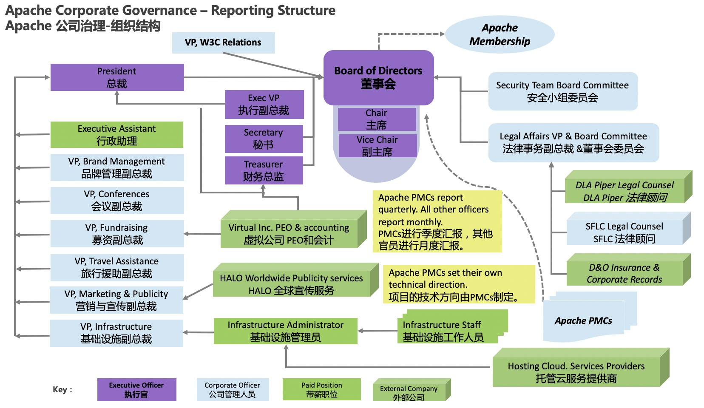

+++
author = "孙金城（Jincheng Sun)"
title = "ASF公司架构和治理"
date = "2020-04-04"
description = "ASF公司架构和治理"
tags = [
    "ASF公司架构和治理",
]
+++

# 公司治理

总的来看，Apache软件基金会（ASF）的治理相当简单：由成员(Member)来选举董事会；董事会任命各种管理人员并创建PMCs；PMCs定期向董事会报告，大多数其他管理人员向总裁然汇报，然后总裁向董事会报告。

## 组织架构和职责

为了更好的管理公司，ASF建立了如下组织架构：

* 现有成员(Member)会定期提名和选举新成员，每年提名并选举9名董事加入董事会。

* 董事会任命业务官员，并将特定政策或业务领域的责任分配给每位官员。例如，法律事务委员会副总裁负责为ASF和所有Apache项目设置法律政策，并与公司顾问进行合作。

* 董事会任命执行官，包括总裁，秘书，财务总监等，他们负责ASF的特定运营。

* 大多数[官员每月直接向总裁报告](https://www.apache.org/foundation/records/minutes/2012/board_minutes_2012_10_17.txt)，而总裁则每月向董事会报告ASF的整体运营状况。

* 基础设施副总裁向总裁汇报，并对基础设施团队的运营进行宏观监督。在团队中，带薪的基础设施 管理者角色有助于管理日常操作，带薪人员确定工作优先级，并维护所有Apache项目中使用的服务。

## 选举和任命

董事会创建并更新项目管理委员会（PMCs）。董事会只是批准孵化器的合理构建请求（毕业成为TLPs）或来自PMCs自身（添加或删除PMC成员）的请求。在每种情况下，向董事会建议进行的变更都已经由相关的PMC完成了投票。如下图所示：

# 项目治理
每个Apache PMC都独立管理他们的项目，以Apache的方式，遵循由所有官员为所有项目设置的一些核心原则。如下图所示：

* PMC每季度直接向董事会报告一次。董事会对PMC进行监督，以确保PMC健康发展，顺利的管理社区，确保PMC遵守Apache的原则。项目的技术方向由PMC指定，董事会不对项目提供技术治理。

* 每个PMC的主席都是该项目的副总裁，因此也是ASF的官员。[主席的主要职责](http://www.apache.org/dev/pmc.html#chair)是确保项目报告全面，并提交到董事会。

* PMC对软件版本发布进行投票。PMC进行适当的发布治理，进而确保了所有的源代码版本发布都是ASF自身的行为。

* PMCs为项目提名并选举新提交者(Committer)。PMCs还负责提名并投票新的PMC成员，然后PMCs向董事会汇报建议的变化。

* Apache孵化器(Incubator)是一种特殊的（I）PMC：它的工作是指导新的Podding社区，以帮助他们学习Apache Way。在每个Poddle对他们的软件发布进行投票后，IPMC成员也对该Podling的发布过程进行监督和投票，以确保Podding逐渐成为一个合格的Apache项目。

* 根据政策，只有个人可以充当会员，提交者(Committer)或PMC成员(Member)或管理人员。这是ASF和[Apache项目保持其独立性的一种方式](http://community.apache.org/projectIndependence)。

# 参考链接
[1] http://www.apache.org/foundation/governance/orgchart