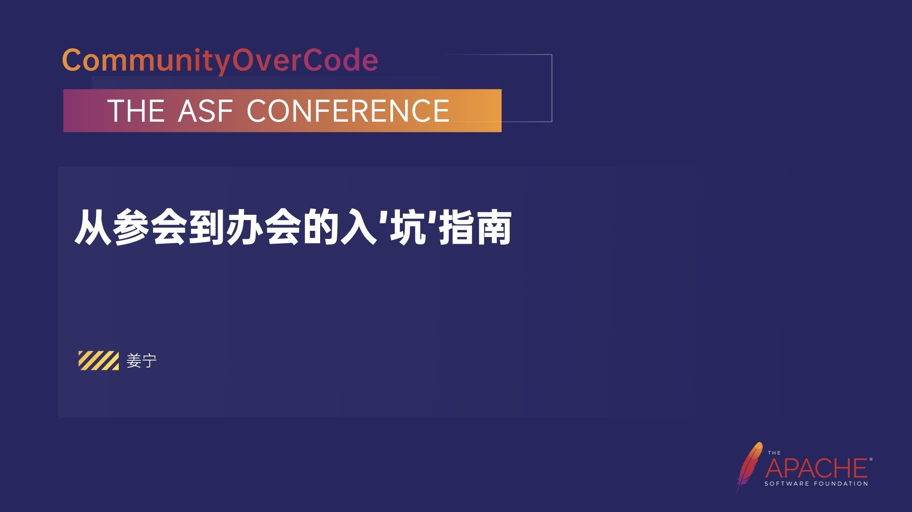
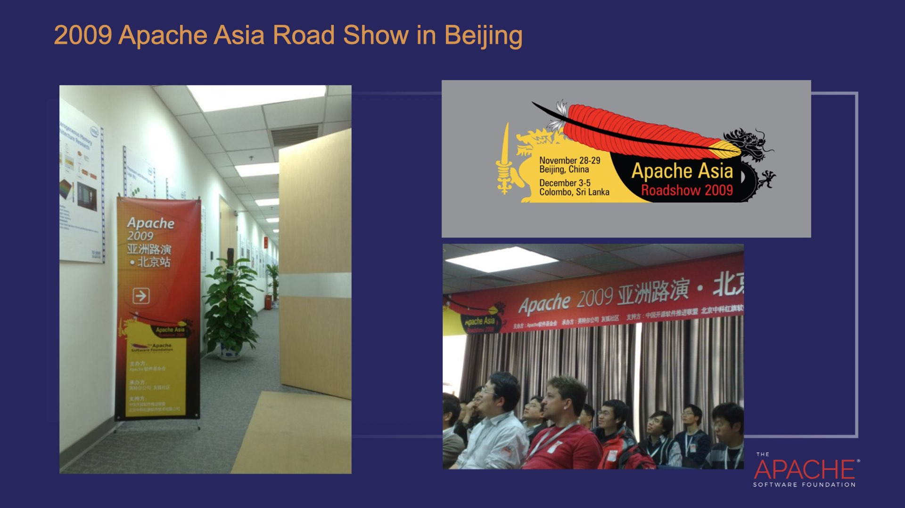
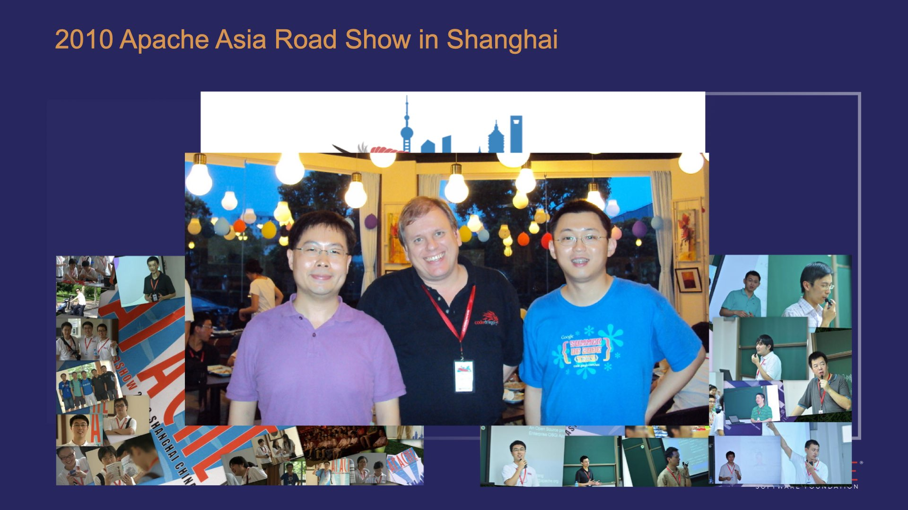
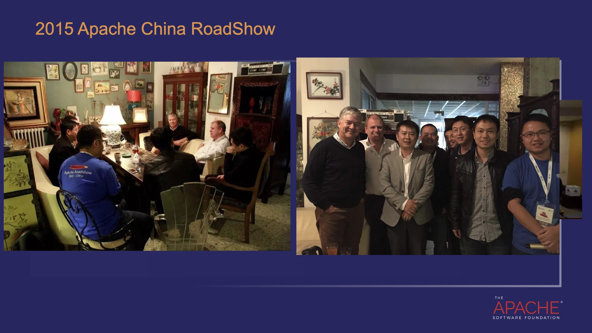
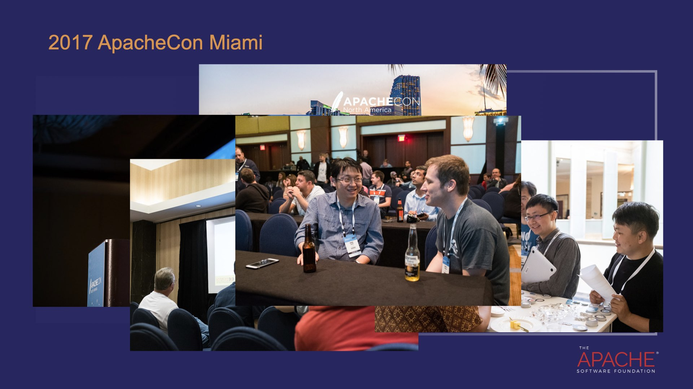
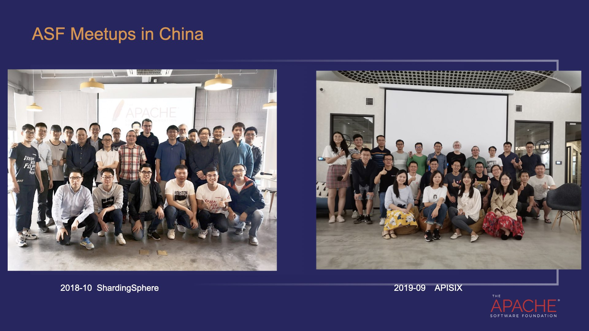
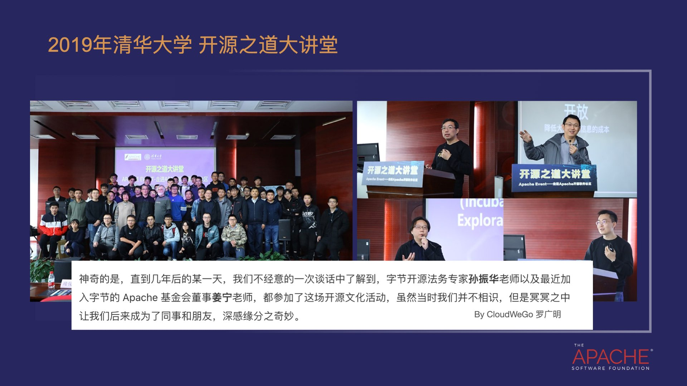
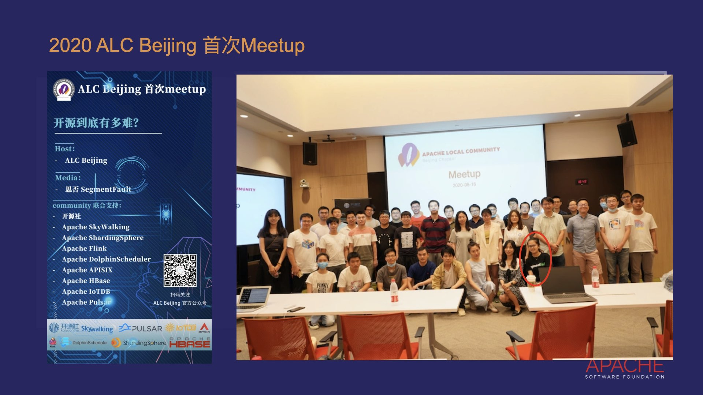
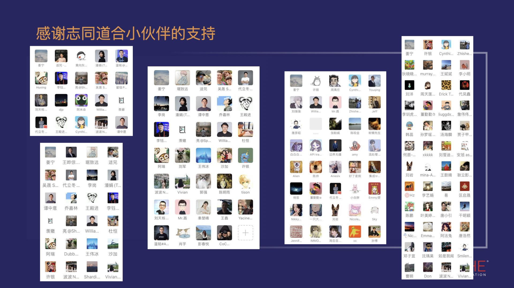

+++
author = "Willem Jiang"
title = "从参会到办会的入’坑’指南"
date = "2023-09-25"
description = ""
tags = [
    "OpenSource",
    "ApacheCon",
    "CommunityOverCode"
]
+++

在CommunityOverCode Asia 2023的闪电演讲中， 姜宁花5分钟总结了他与ApacheCon之间的故事以及收获, 也解释了为什么能够坚持三年办会的原因。

是什么原因支撑着我办Apache大会，这需要从我参加的Apache活动讲起。

2007年我第一次参加ApacheCon， 见到了很多只在email里面沟通的大牛，体验了会前的hackthon，在两天时间里和大牛思想碰撞，当时给Apache Camel提交了负载均衡的代码。尝试了边喝啤酒边写代码简单而纯粹的快乐！

2009年在北京中关村，融科，Intel 研发中心，[参加 Apache 北京路演](https://cwiki.apache.org/confluence/display/APACHECON/ApacheRoadshowAsia09Beijing)，第一次听到Hadoop， 天使投资， 见到的著名的陈绪同学，近距离在家门口感受到了开源的氛围。
另外2006年 ApacheCon Asia 第一次大会是在斯里兰卡召开的。

2010年在上海，复旦大学，张江校区，两天的 [Apache 路演大会](http://people.apache.org/~tonywu/Roadshow10/slides.html)，
当时公司支持开发同学外出演讲对外发声，于是我报名参加大会做了有关Camel的演讲，同时顺道参观的上海世博，还赢了一台iPad。
照片是 Freeman， Niclas Hedhman 和当时去健身房减了十斤的我， 满满的胶原蛋白吧！

2015年 北京，中关村，科学院大学，开源社主办的 [Apache China 路演会议](https://kaiyuanshe.github.io/tags/Apache/)
这是其中一个圆桌论坛，微软C#/TypeScript 之父 Anders Hejlsberg ， Niclas Hedhman
会后大家一起合影， 这是韩卿，我，梁辰晔（之后成为华为的同事）， 赵生宇（19年再次见面，开启了更多的合作）， 通过大会结识了很多小伙伴，在后续的开源道路上相互协作。

2017年， 这是时隔10年之后， 终于能够再次参加Apache北美大会，这次的会议的目的地是Miami，当时参会的主要目的是帮助ServiceComb寻找孵化导师。  可以看到 Rich， Justin， 阿里的同学，张乎兴，王晓瑞， 冯嘉。 当然也少不了啤酒， 当时正好和Mark Tomas 聊天。

借 18年，19年的 HuaweiConnect 大会，邀请到了 ASF的 Craig， Roman， Justin访华，组织和国内的 Apache 开发者见面。
取得成果是 2018年 推动了 ShardingSphere 进入ASF孵化，2019年 推动 APISIX 进入ASF孵化。
当时和Craig就有聊过在中国办大会的想法，但是因为没有办过大会，心里还是没有底，还没有真正付诸行动。

时间一下子跳到2019年，在清华举行的开源之道大讲堂，后来我现在字节的同事罗广明写了一篇文章专门提起了这件事， 冥冥之中开源和Apache把我们连接在了一起。

中间两年因为签证的原因没能参加 ApacheCon 北美大会，于是开始也在思考能不能在家门口办这样的大会。

2020年的时候发起了 ALC Beijing，8月份这是我们的第一次线下聚会，聚会的题目是 做开源到底有多难？ 在我看来在这么多ASF 项目的开发者，有ALC Beijing成员的帮助下， 在国内推广开源不再那么困难了。 有趣的点是那时和思否的小伙伴结识，一起共谋大事， 大家看到波波了吗？

于是从2021开始，我们连续举办了三界 ASF 亚洲大会，这也就有了我们今天这次演讲！

在此我们要感谢我们大会的组织者和志愿者团队， 没有大家的支持和帮助我是不可能坚持下来。

最后终结一下：

* 这是非常奇妙的经历， 通过参加 Apache Event 可以结识很多开源志同道合小伙伴！
* 从参会到办会体会到了 Community 的力量，
* 和一群志同道合的小伙伴一同达成之前想都没有想过的目标。
* 虽然有些时候会辛苦一些，但是所有这些付出都是值得的！

祝愿各位在今天的大会上能结识到更多志同道合，共同成长的小伙伴！
