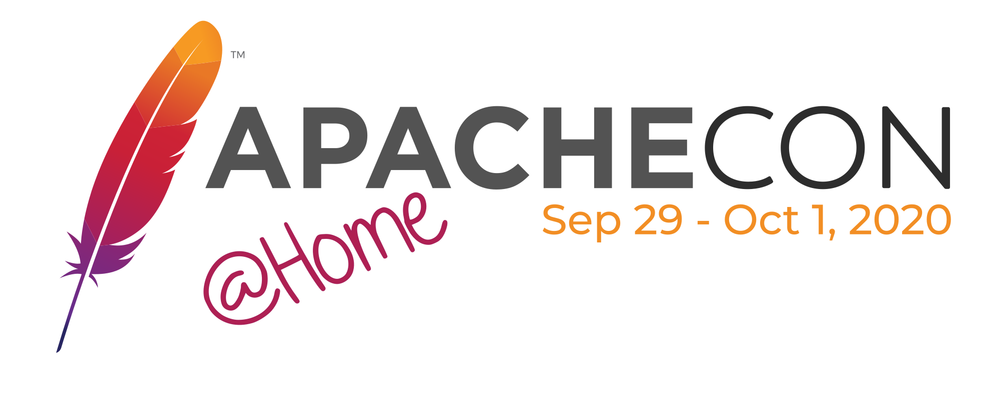

+++
author = "yang-7777"
title = "ApacheCon 2020 参会指南"
date = "2020-09-15"
description = "The creation story about ALC-Beijing"
tags = [
    "ApacheCon",
]
+++

每年一度的 Apache北美大会因为疫情的原因转到线上来举行了， 这次会议的主题是[ApacheCon@Home](https://apachecon.com/acna2020/), 也就是说借助网络我们可以足不出户就可以参加Apache大会了。
今年的会议为了针对不同的地域特点，特地安排了不同时间段的演讲，同时还专门增加了[中文的演讲](https://www.apachecon.com/acah2020/tracks/mandarin.html
)，欢迎大家关注。

下面今年ApacheCon的参会指南译自 https://apachecon.com/acah2020/guide.html，祝大家参会愉快！

### 前期准备
为了您在ApacheCon@Home可以得到最好的体验，我们为你准备了以下清单，这样参会者就可以提前准备。 请提前浏览以下的技术要求和参会前可以准备的事项，这样就不需要在会议的过程中进行任何准备了。

### 注册
请确认你已经在 [ApacheConf @Home at Hopin](https://hopin.to/events/apachecon-home) 注册，如果你在右上角看到一条消息写着“You‘re in” 说明注册成功，借此机会可以点击“Add to calendar”将会议时间加入到日历。

### 网络速度
请尝试接入到至少 5Mbit/s 下载速度和2Mbit/s 上传速度的网络。下载速度和上传速度越高越能够提供一个更好的体验，30Mbit/s 的下载速度和10Mbit/s 上传速度是最理想的。尝试限制其他可能占用网速的访问客户，比如：提前一天将软件更新完成，避免软件在会议中运行，暂停或停止所有大型下载项目，如果需要可以断开其他设备的网络连接。推荐用网线进行网络连接。可以用一个在线网站进行网络速度检查，搜索 [Internet speed test](https://duckduckgo.com/?q=internet+speed+test&ia=web)。

### 浏览器
Hopin [支持](https://support.hopin.to/en/articles/2559500-hopin-compatibility) [Google Chrome](https://www.google.com/chrome/) (推荐) 和 [Mozilla Firefox](https://www.mozilla.org/en-US/firefox/new/) (备选)，其他浏览器均不支持。请确认您的浏览器是最新版本，按照浏览器说明 [Chrome](https://support.google.com/chrome/answer/95414) 或 [Firefox](https://support.mozilla.org/en-US/kb/update-firefox-latest-release) 进行操作。

注意，Safari 与 Chrome 用的是同一引擎，用Safari打开网页也显示成功。但是，我们还是推荐使用Chrome。

请减少打开的网页数量和关闭不必要的浏览器扩展工具。不要打开多个Hopin的网页，如果有这样的需求请只保留一个网页的声音，其余静音。

### 设备
请优先考虑使用台式电脑或者笔记本，如果你使用的是平板电脑和手机设备确保你使用的是Google Chrome 或 Mozilla Firefox。

### 文献资料
在Hopin 上浏览为 [参会者](https://support.hopin.to/en/collections/1945014-using-hopin-as-an-attendee) 和 [演讲者](https://support.hopin.to/en/collections/2208884-using-hopin-as-a-speaker) 编写的文档。

### 填写个人资料
填写你的 [Hopin个人资料](https://hopin.to/users/sign_in)，以帮助建立会议成员之间的交流并找到志趣相投的人。你的个人资料会被保护仅会共享你同意的信息。

### 选择会议
浏览 [track](https://apachecon.com/acah2020/tracks/) 页面，然后选择您感兴趣的会议。在每个会议旁边，您会找到日历（📅）图标，单击该图标将为您提供iCalendar（.ical）文件，您可以将其导入日历软件中。单击会话的日期和时间将带您到一个在线服务，可用于将会话时间转换为不同的时区。会话时间轴上方显示的时间反映了您当地时区的时间，因此请确保您的计算机为您所在的地区配置了正确的时区。

## 会议中
在会议中你可能遇到一些问题，我们整理了一些常见的问题和一些通用的建议去避免问题的出现。

### 声音和视频
为了在会议中有更好的声音和图像的体验这里列举了一些建议：

要最大化演讲者视频或演示视频，请双击该视频流，这将放大视频流的该部分。
使用耳机播放音频，这将有助于理解演讲者的发言，并防止在网络连接过程中出现任何音频反馈。
请注意提示您允许访问麦克风或摄像头的提示，一旦被拒绝，则需要明确允许访问。请查阅有关在 [Firefox](https://support.mozilla.org/en-US/kb/how-manage-your-camera-and-microphone-permissions) 和 [Chrome](https://support.google.com/chrome/answer/2693767?co=GENIE.Platform%3DDesktop&hl=en) 中允许访问的文档。
