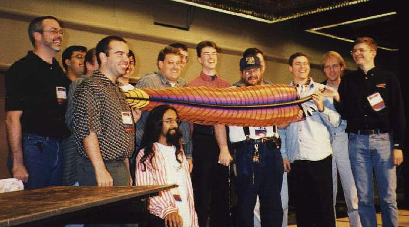

+++
author = "djwang"
title = "年度开源盛会ApacheCon首发中文盛宴来临，欢迎报名！"
date = "2020-09-16"
description = "ApacheCon 2020 Mandarin Track Introduction"
tags = [
    "ApacheCon",
]
+++

# 简介

ApacheCon 是久负盛名的开源盛宴，为开源界备受关注的会议之一，也是开源运动早期的知名活动之一，其最早的一期要追溯1998年，也是在这一届上，开发HTTPD服务的开发者们欢聚一堂，并决定成立 Apache 软件基金会。

1998年首次ApacheCon大会照片

[photo attribution (CC BY) Mark Cox. Tagged image at https://www.flickr.com/photos/iamamoose/63963722/in/album-1381277/ ; gallery at https://www.flickr.com/photos/iamamoose/albums/1381277]

ApacheCon由Apache软件基金会举办，现在是每年举办一次，一般在欧洲或北美举行，是Apache开发者们线下交流、讨论、见面的绝佳机会，也是分享想法、思想激荡的难得的场合。随着计算机技术的发展，ApacheCon每年的议题也在不断的增多，尤其是火热的大数据，干脆分离出来独立开启会议。

ApacheCon 大会官网：https://apachecon.com/acah2020/index.html。

2020是特殊的一年，尽管对于Apache的整体开发来说没有什么影响，但是线下交流是无法实现了，毕竟病毒仍在肆虐，只好像其它的大型会议一样，今年选择了在线上举办，线上举办的好处就是加大了更多可能性，比如支持多语言的分论坛，要知道讲中文的议题还是在ApacheCon上头一次出现。如此的机会怎能错过？

从9月29日到10月1日，会议共持续3天。官方议程已公布，可前往官网查看[议题详情](https://apachecon.com/acah2020/tracks/)。同时，大会免费开放注册，可在[Hopin平台报名](https://hopin.to/events/apachecon-home)。

# ApachCon普通话论坛

本次ApacheCon大会专门设置了普通话演讲论坛（[APACHE MANDARIN TRACK](https://apachecon.com/acah2020/tracks/mandarin.html)），方便国内观众参与。该论坛共邀请12位Apache Member/Contributor、开源人士和工程师，围绕Apache项目、开源等话题展开分享各自的实践与经验。

目前国内开源项目与社区不断发展壮大，相信本论坛嘉宾的分享会给大家带来更多思考。下面对本论坛议题做下简单介绍，以供诸位参考。如果你想参加本论坛，记得[提前注册](https://hopin.to/events/apachecon-home)哟。同时，也附上[ApacheCon 2020 参会指南](https://alc-beijing.github.io/alc-site/post/apachecon/apachecon-2020-guide)，为了获得更好的参会体验，请确保事先阅读哦。

## 议题详情

### 《New Apache Members from China, responsibilities and obligations》

### （来自中国的新Apache软件基金会会员，责任与义务）

**分享时间**：2020年9月29日，星期二，下午5:30（北京时间）
**议题简介**：在新晋的35位ASF Member中有11位来自于中国， 随着越来越多起源自中国的项目从孵化器毕业成为顶级项目， 越来越多的中国人深度参与到Apache基金会的工作中来。 在这个圆桌论坛上， 我们邀请了中国的Apache Member来谈一下他们的开源历程，以及他们对Apache软件基金会和开源世界的责任与义务。 
**分享嘉宾**：吴晟，潘娟，姜宁，张铎
> 吴晟，ASF Member，Apache SkyWalking VP和PMC成员，同时也是Apache ShardingSphere, Apache APISIX和 Apache Incubator的PMC成员。他做为多个来自中国的Apache项目导师，多次在公开会议中发表关于开源的演讲。
> 姜宁，ASF Member，华为技术专家。他参与过Apache Camel, Apache CXF, Apache ServiceMix以及 Apache ServiceComb等多个项目。在加入华为之前，他是红帽软件的首席软件工程师，同时他也在FuseSource， IONA以及中航信工作过。 他在QCon北京、架构师峰会上做过有关微服务和分布式系统，以及开源相关演讲。
> 张铎，ASF Member，小米云平台部专家软件工程师。他是Apache HBase项目的主席，也参与过一些其他的Apache项目，例如Hadoop，Yetus等等。他还是数个Apache孵化器项目的导师，例如Nuttx和Pegasus。
 

### 《From Web Engineer to Apache APISIX PMC》
### （从Web工程师到Apache APISIX PMC成员）

**分享时间**：2020年9月29日，星期二， 下午6:10（北京时间）
**议题简介**：在接近6年的 Web 学习过程中，我从开源社区受益颇多，众多的社区资源在帮助自己不断成长！在本次会议中，我将分享自己从一名 Web 工程师到持续参与开源项目的经历，以及加入 Apache APISIX 项目后，感受到的社区风格与文化，以便让更多开发者了解、参与并拥抱开源项目，一起更好地维护社区生态。
**分享嘉宾**：琚致远 
> 琚致远，支流科技工程师，开源网关项目 Apache APISIX PMC，freeCodeCamp中国核心组织者。致力于人人皆可编程，并鼓励更多人参与到开源项目中来。
 
### 《New Features of Apache CarbonData 2.0》
### （Apache CarbonData 2.0 新功能）

**分享时间**：2020年9月29日，星期二，下午6:50（北京时间）
**议题简介**：今年6月Apache CarbonData发布了2.0版本，相较之前的1.x版本，显著提升了数据接入和数据分析能力，增强了PB级大表索引及多维查询能力，完善了CDC特性支持update,delete和merge功能，重构MV支持多种数据格式等。
**分享嘉宾**：蔡强
> 蔡强，华为工程师，Apache CarbonData Contributor，10年以上大数据系统研发经验，对Hadoop, Spark和Hive等大数据系统有深刻的理解。作为Apache CarbonData项目初始成员及PMC, 负责入库及索引等特性的核心架构设计。

### 《ECharts: could the customization be both easy and highly personalized?》
### （ECharts: 能否同时“使用简单”和“强个性化定制”？）

**分享时间**：2020年9月29日，星期二，下午7:30（北京时间）
**议题简介**：数据可视化图表库的主要职责是，找到合适的抽象方式，来简化数据可视化的编程。这往往须基于通用案例、易用性、灵活性、可维护性等因素，抽象形成概念和 API，提供给用户来学习和表达。这其中，“开箱即用”式的简便，和个性化强定制能力，如何去共存？本主题分享了 echarts 多年演进中对这些抽象的认知，以及通过“自定义系列”、“系列坐标系组合”等概念设计，来实现个性化图表的案例。
**分享嘉宾**：宿爽
> 宿爽，百度工程师，Apache ECharts 项目 PPMC。 

### 《New Feature of Apache ShardingSphere 5.x
### （Apache ShardingSphere 5.x新功能）

**分享时间**：2020年9月29日，星期二，下午8:10（北京时间）
**议题简介**：
Apache ShardingSphere 5.x 的第一个版本即将发布。在 5.x 版本中，Apache ShardingSphere从架构设计到产品范围都做出了重大革新。在这个版本中，ShardingSphere 遵循可插拔的体系架构设计理念，构建一个灵活的、可嵌入的和可扩展的项目。新版本不再将数据分片作为产品唯一的核心功能主线，而是转向构建分布式数据库生态系统。
在新版本中，数据分片、分布式事务和数据库治理等核心功能与内核完全分离，成为内核可插拔组件的一部分。整个产品的生态系统通过SPI织入的形式全面开放，将数据迁移、弹性调度、数据加密、影子库压测等全新功能完全融入产品生态。本次分享将全面介绍 Apache ShardingSphere 5.x 的新功能及其架构形态。
**分享嘉宾**：张亮
> 张亮，京东数科数字技术中心架构专家，Apache ShardingSphere 项目管理委员会主席，开源项目 ElasticJob 创始人。热爱开源，推崇优雅代码，曾出版书籍《未来架构——从服务化到云原生》。GitHub: https://github.com/terrymanu，随时欢迎技术交流和指正。

### 《How does Apache Dolphin Scheduler (Incubator) support 100,000-level data task scheduling?
### （Apache Dolphin Scheduler是如何支撑每日十万级别的数据任务调度的？）

**分享时间**：2020年9月30日，星期三，下午5:00（北京时间）
**议题简介**：
Apache DolphinScheduler(incubator)是一个分布式易扩展的可视化大数据任务调度系统，致力于解决大数据处理流程中错综复杂的依赖关系，使调度系统在数据处理流程中开箱即用。自去年8月进入apache孵化器后，已有120+多位贡献者，微信用户群3000多人，已有IBM、美团、360等数百家公司应用。
本次分享首先会介绍DolphinScheduler社区的发展情况，然后会介绍我们当时为何要重复造轮子再造大数据任务调度，DolphinScheduler整体的设计思想、考量以及DolphinScheduler的特性和能力，接下来会介绍DolphinScheduler架构的变迁过程。
在此次分享中我也会讲述我们在做大数据任务调度时遇到的挑战和积累下来的经验，也会分享一些用户案例和使用场景，最后会分享一下开源的历程
**分享嘉宾**：代立冬
> 代立冬， 易观大数据平台总监 & Apache DolphinScheduler PPMC，负责每日数百亿条数据处理链条的架构设计，技术选型，技术攻关，人才招募与培养等工作。

### 《OSS.Chat - A bridge to the Apache Way in China》
### （OSC.Chat - Apache之道在中国的桥梁）

**分享时间**：2020年9月30日，星期三，下午5:40（北京时间）
**议题简介**：OSS.Chat 项目的使命是为开源项目开发社群搭建一道打通 WeChat 及其它社交平台 (未来) 和 GitHub Issues 与邮件列表的三向沟通和翻译壁垒的桥梁，让 ASF 的文化、技术和协作流程能尽快地容易地被接受，而不是一开始就磕磕绊绊。通过 Chatbot 这种自动化流程机制，让开发者能够更加便捷的分享和沟通开源项目的开发信息。尤其是对社区开放资料的存档和二次归纳处理，是我们认为很有意义的一件事情。透过 OSS.Chat 项目，我们希望能进一步推广、传播乃至于优化 Apache 项目社区的文化、技术、与协作。
**分享嘉宾**：李卓桓
> 李卓桓，Tencent TVP of Chatbot，天使投资人。清华大学本科，中欧国际工商学院EMBA，北京邮电大学 CS Ph.D（在读）。曾任水木清华BBS站长，并创立 zixia bbs。OSS.Chat 项目 Committer，GitHub 8,000+ Stars 开源 Chatbot 项目 Wechaty 作者，Conversational AI 践行者。著有《智能对话与深度学习》、《Chatbot从0到1》、《简明的TensorFlow 2》等技术作品。

### 《Apache TubeMQ: a new choice of MQ in big data scenarios
### （Apache TubeMQ： 大数据场景下的新的MQ选择）

**分享时间**：2020年9月30日，星期三，下午6:20（北京时间）
**议题简介**：
Apache TubeMQ（incubating）是支撑万亿级数据规模的分布式消息队列（MQ）系统，专注于海量数据下的数据传输和存储。与许多开源MQ项目相比，TubeMQ在稳定性，性能和低成本方面具有独特的优势。
本次交流主要介绍大数据场景下数据传输从百亿到万亿量级变化时消息中间件（MQ）所面临的挑战，分析TubeMQ是如何解决这类问题来满足业务需要；同时针对后面TubeMQ发展进行探讨。
**分享嘉宾**：张国成
> 张国成，腾讯资深研发工程师，可以在 https://github.com/apache/incubator-tubemq了解到他的最新活动。

### 《Apache Doris - A fast MPP database for all modern analytics on big data
### （Apache Doris- 一款支持对海量数据进行快速分析的MPP数据库）

**分享时间**：2020年9月30日，星期三，下午7:00（北京时间）
**议题简介**：
Apache Doris(Incubating) 是一款支持对海量数据进行快速分析的MPP数据库。Doris自设计之初，就秉承着极简运维、高效可靠、易学易用的原则，为用户提供全面而高效的海量数据分析能力。自2018年底进入Apache孵化器后，Doris已经发布了5个大版本，接收了来自社区100多位开发者的贡献，并在多加互联网头部企业和垂直领域企业落地和应用。
本次分享主要包含Doris的发展历程、系统架构、主要特性和应用案例四个部分，帮助听众对Doris有一个全面而具象的认识。同时，本次分享也会介绍刚刚发布的0.13版本以及即将发布的0.14的新特性。在新版本中，我们能看到Doris正在向着批量和实时统一的数仓领域探索，帮助简化企业大数据平台架构。最后我们会介绍Doris社区目前的发展情况，希望能够帮助开发者更方便快捷的加入开源社区。
**分享嘉宾**：陈明雨
> 陈明雨，百度资深研发工程师，6年分布式系统研发经验，一直专注于分布式可扩展分析型数据库领域，主导参与了 ApacheDoris 从百度开源到进入 Apache 孵化器的全过程，同时也是 ApacheDoris 的 PPMC 成员。

# 大会报名

各位感兴趣的小伙伴，如果你想了解更多Apache项目、了解开源社区动态与大咖交流，赶紧报名啦！这里再同步下ApacheCon大会重要信息，大会举办日期为9月29日-10月1日，共持续3天。官方议程已公布，可前往官网查看[议题详情](https://apachecon.com/acah2020/tracks/)。

免费报名：https://hopin.to/events/apachecon-home 
或扫码报名：

