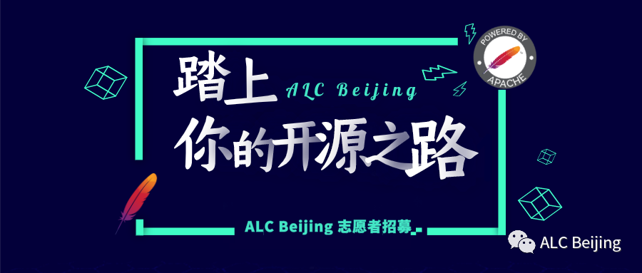

+++
author = "李钰（Yu Li)"
title = "ALC Beijing 志愿者招募"
date = "2020-04-21"
description = "ALC Beijing Call for Volunteer"
tags = [
    "志愿者，Volunteer",
]
+++

> Open source is changing the world. And if you want to be a part

> of that change, all you have to do is participate. 

> Jason Hibbets《 the foundation of an open source city》

# 什么是 ALC?

ALC是Apache Local Community的缩写，是全世界范围的 Apache 开源爱好者本地群组 [1]。
因为是本地组织，ALC 是按照城市或地区的方式进行划分的，类似的机构还有 GDG (Google Developer Group), Facebook Developer Circles, Mozilla Reps 等。
任何 Apache 开源爱好者都可以代表自己所在的城市向 ALC 提出申请创建本地的组织。

# 为什么创建 ACL-Beijing?

根据 ASF 2019 年年度报告 [2]，中国已然成为Apache软件基金会项目下载量最大的地区。
然而，这个看起来脱颖而出的数据背后，却暴露出我国这片土地上几个可能让大家颇为惊讶的现状：

* ASF 拥有7000+代码贡献者，然而为 ASF 项目提交贡献的中国本土工程师仅千人规模，不足七分之一。
* ASF 项目约350个，然而由中国本土发起的 ASF 项目仅19个，已成为顶级项目的比例更是不足5%。
* ASF 孵化器拥有导师200多个，然而活跃的中国导师不超过5位。
* ASF 每年在美国、欧洲等地举办 ApacheCon ，然而迄今为止尚未在中国举办过一次。

作为全球最大开源消费国， ASF 在国内有广泛的群众基础，如何将这些开源项目用户发展转换成为社区的贡献者、开发者，
甚至成为开源项目的发起者、维护者是一个值得深思的问题。

基于对这个问题的思考，我们创建了 ALC-Beijing，并且致力于通过（但不限于）下述行动帮助开源爱好者更好的在 Apache 社区生根发芽：

* 举办线上和线下沙龙，将本地的开发与用户聚焦在一起。
* 通过分享开源开发经验，鼓励更多的人参与到 ASF 的项目开发中来。
* 为 ASF 的项目寻找相互合作的机会，让这些项目能够更加茁壮的成长。
* 介绍 ASF 管理和运作开源项目的成功之道，帮助大家更好地运作开源项目。

# 志愿者招募

为了更好的推广开源，我们诚挚的邀请您加入志愿者行列，只要您：

* 热情，大方，细心，有责任心
* 热爱开源，愿意为中国本土的开源发展贡献自己的一份力量
* 具有良好的团队合作意识
* 具备下述能力中的任何一条，或者您认为我们需要的能力
  * 网站开发和维护
  * 文案撰写
  * 文章编辑
  * 主持、采访
  * 线上或线下的活动组织、策划、执行

由于受疫情影响，近期 ALC-Beijing 主要以线上活动为主，您可以帮助我们：

* 解决网站模板的问题 [3]
* 对ALC Beijing 成员进行采访宣传 [4]
* 维护、编辑公众号文章

# 志愿者福利

首先，我们希望您是真的喜爱、热爱开源，愿意投身到改变世界的开源事业当中。

其次，通过参与 ALC-Beijing 的志愿活动，您可以：

* 学习开源知识，扩展视野
* 获得训练技能机会：演讲、主持、写作、沟通
* 得到与 ASF Member、项目 VP/PMC 大牛们深度沟通的机会
* 随时、深度参与 ALC-Beijing 组织的线上/线下活动
* 深入理解 Apache 之道，倡导开源哲学

# 加入方式

如果您有意成为 ALC-Beijing 志愿者，请将个人简历发送至ningjiang@apache.org，期待您的加入！

[1] https://cwiki.apache.org/confluence/display/COMDEV/Apache+Local+Community+-+ALC
[2] https://s.apache.org/FY2019AnnualReport
[3] https://github.com/WillemJiang/alc-site/issues/16
[4] https://github.com/WillemJiang/alc-site/issues/12
