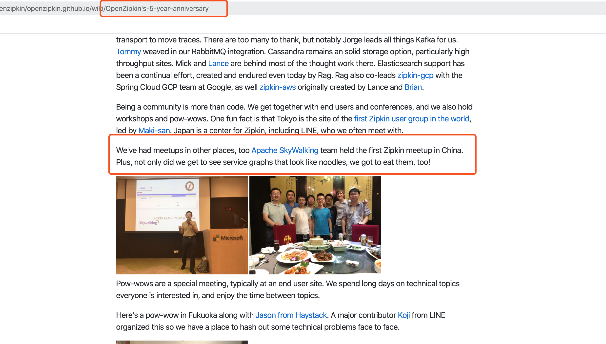

---
categories:
- 开源
- Apache way
- 播客
- 传播
date: 2020-04-27T16:10:58+08:00
description: "ALC Beijing Podcast Episode #1， 聊聊Apache  SkyWalking 的故事！是幸运还是坚持？是技术实力过硬？还是人缘杠杆？Apache TLP 是如何炼成的？这些你都需要了解一下。"
keywords:
- Open Source
- Culture
- Reading
- News
- Podcast
tags:
- ALC Beijing 播客
title: "Podcast Episode #1：Apache SkyWalking 那些事"
subtitle: ""
url: ""
authors:
- ALC Beijing
---

## 内容梗概

个人项目、Apache TLP、潇洒的创始人、众多的客户、多个云厂竞相支持、中国本土、APM骨灰级玩家.......拥有众多光环的 SkyWalking ，究竟有何神奇的魔力？在短短的几年内迅猛发展，在竞争如此激烈的APM 市场，获得无数的拥泵！ ALC Beijing Podcast 首秀，诚挚邀请到 Apache SkyWalking的创始人、主要的贡献者来聊聊 SkyWalking的酝酿、命名、开发、开源、建设Community、收获用户、发展壮大、进入Apache、孵化、成为TLP、下一代版本、如何维护的。我们就是来不正经地“八卦” Apache 开源项目背后故事！

>  SkyWalking社区拥有来自全球的，200位以上的贡献者包括30多位以上的 Committer。SkyWalking的项目用户和贡献者来自亚洲、欧洲、北美。那么，SkyWalking的社区到底是什么样子？推进社区发展和合作的原则和背后的逻辑是什么？
> ​

## 本期亮点

* ALC Beijing 介绍
* SkyWalking 这么酷炫的名字是从何而来的？是星球大战迷？还是信手拈来？
* 一位”007“全职之余的贡献者，是如何在为SkyWalking贡献中获得个人娱乐和满足的
* SkyWalking 获“友商”青睐，受邀在竞品项目的会议上分享
* .Net 探针的相爱相亲记
* SkyWalking 受到各大云厂商的支持和追捧
* SkyWalking 是如何获得一位同类项目开发者的赏识，放弃原有代码，转而全力加入SkyWalking的
* 创始人兼VP兜底自己的Merge “摸鱼”行为
* 主要的维护者打算什么时候离开项目，彻底交出控制权？
* 下一个版本，竟然还不知道开发什么功能？(ÒωÓױ)！

## 请收听

[ALC Beijing Podcast Episode #1: Apache SkyWalking 精彩开源故事](https://www.ximalaya.com/keji/37853515/294907345)

## 出场嘉宾

**潘娟** （主持人）：京东数科高级DBA，Apache ShardingSphere PMC，ALC Beijing Member。

**姜宁**：Apache Member ， ALC Beijing 发起人，华为开源软件中心技术专家，前红帽软件首席软件工程师，有十五年以上企业级开源中间件开发经验，有丰富的 Java 开发和使用经验，函数式编程爱好者。从 2006 年开始一直从事 Apache 开源中间件项目的开发工作，先后参与 Apache CXF， Apache Camel，Apache ServiceMix，以及Apache ServiceComb的开发。2015年开始担任Apache 孵化器导师，参与孵化了 Apache Rocket， Apache Skywalking， Apache ShardingSphere， Apache iotDB， Apache Doris， Apache APISIX， Apache Weex。

**吴晟**：Founding Engineer at Tetrate. Apache Member. He leads the Apache open source APM/Observability analysis platform project, SkyWalking, which has been included in cncf cloud native landscape. Be a PMC member of Apache Incubator. Take part in Zipkin and Apache ShardingSphere as a PMC member. Speak at multiple conferences, including LC3 China twice, QCon Beijing (star speaker) three times. Also be the member of Cloud Native Computing Foundation (CNCF) OpenTracing Specification Council, contribute to the OpenTracing project.

**柯振旭** : Apache SkyWalking PMC 成员, Apache Dubbo Committer, ALC Beijing Member, 阿里巴巴高级工程师, 开源爱好者；

**适兕**（联合主持人）：开源之道共同体（opensourceway.community）发起人，self-employee，ALC Beijing Member，开源社成员，开源布道师，作家。

## 相关链接

1. http://skywalking.apache.org
2. https://twitter.com/adrianfcole/status/1249856830777384962
3. https://thenewstack.io/apache-skywalking-use-profiling-to-fix-the-blind-spot-of-distributed-tracing/
4. https://alc-beijing.github.io/alc-site/

## 关于 ALC Beijing

作为全球最大开源消费国， ASF 在国内有广泛的群众基础，如何将这些开源项目用户发展转换成为社区的贡献者、开发者， 甚至成为开源项目的发起者、维护者是一个值得深思的问题。

基于对这个问题的思考，我们创建了 ALC-Beijing，并且致力于通过（但不限于）下述行动帮助开源爱好者更好的在 Apache 社区生根发芽：

- 举办线上和线下沙龙，将本地的开发与用户聚焦在一起。
- 通过分享开源开发经验，鼓励更多的人参与到 ASF 的项目开发中来。
- 为 ASF 的项目寻找相互合作的机会，让这些项目能够更加茁壮的成长。
- 介绍 ASF 管理和运作开源项目的成功之道，帮助大家更好地运作开源项目。
